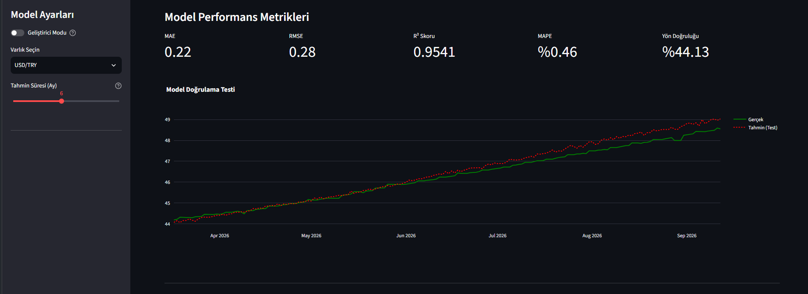
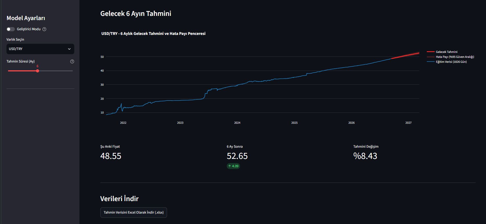
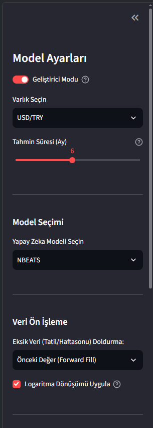
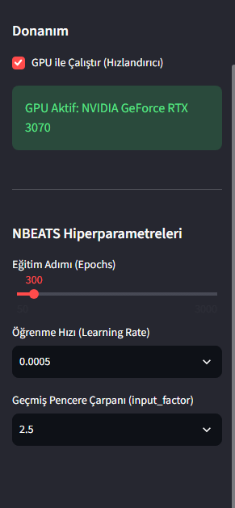
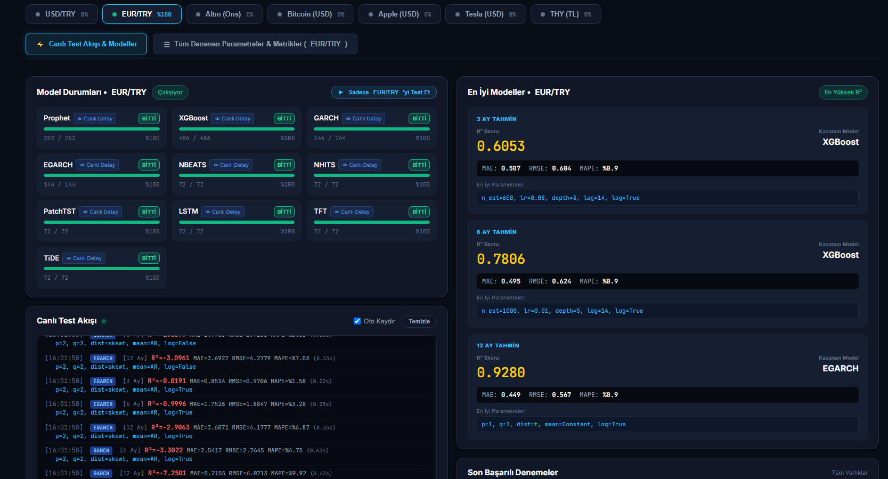
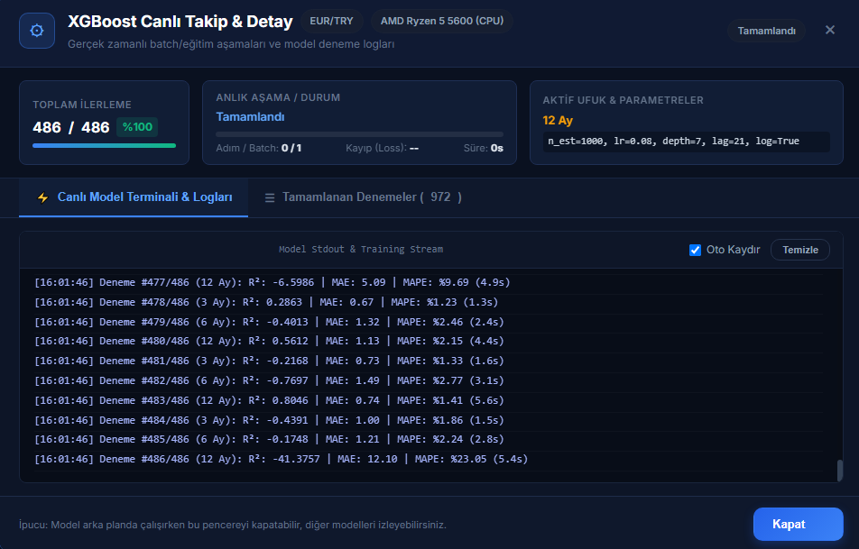
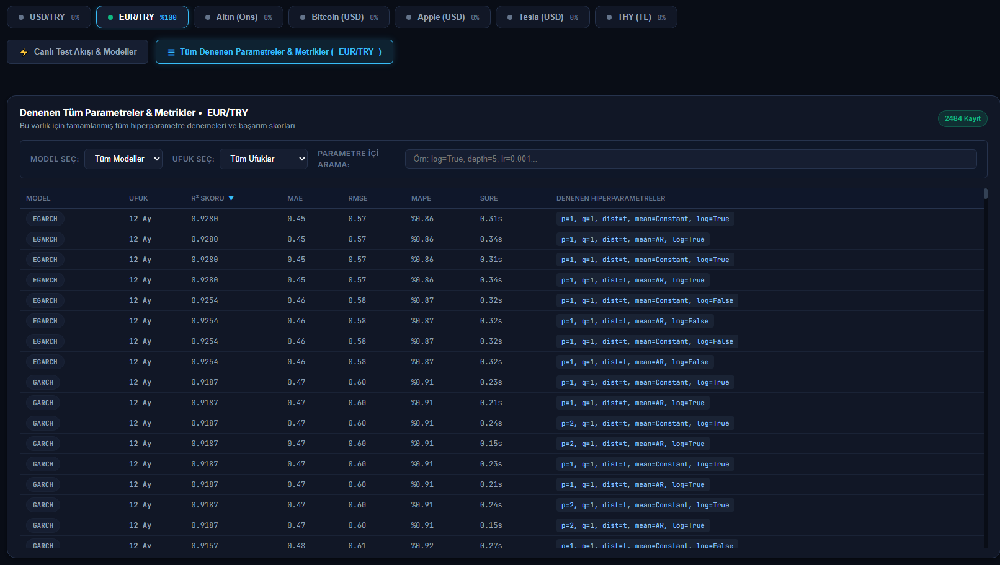

# Finansal Zaman Serisi Tahmini ve Hiperparametre Optimizasyonu

Bu repo; finansal varlıkların (döviz, altın, kripto para ve hisse senetleri) zaman serisi verileri üzerinde model eğitimi, ileriye dönük tahminleme ve hiperparametre optimizasyonu (grid search) gerçekleştiren iki modüllü bir sistem içerir.

---

## Modüller

Sistem iki bağımsız bileşenden oluşmaktadır:

### 1. Tahmin Uygulaması (`app.py`)
Streamlit tabanlı arayüz; Yahoo Finance API üzerinden canlı piyasa verilerini çeker, seçilen varlık ve tahmin ufkuna (1 - 12 ay) göre modeli eğitir, geçmiş veriler üzerindeki test performansını ölçer ve gelecek dönem projeksiyonunu hesaplar. Tahmin sonuçları ve güven aralıkları Excel (`.xlsx`) formatında dışa aktarılabilir.

### 2. Grid Search Paneli (`grid_search/server.py`)
Flask ve Socket.IO tabanlı web arayüzü; 10 farklı model için eşzamanlı hiperparametre kombinasyonlarını test eder. Her varlık için 3, 6 ve 12 aylık vadelerde en düşük hata ve en yüksek R² değerini veren parametre setlerini belirler. Eğitim süreçleri WebSocket üzerinden canlı izlenebilir. Her bir veri seti yaklaşık 1 saat içerisinde (ekran kartı varlığına ve gücüne göre değişkenlik gösterebilir) 3 ayrı ufuk için en iyi parametreleri bulur.

Elde edilen sonuçlar ve parametreler otomatik olarak iki ayrı CSV dosyasına kaydedilir:
- `grid_search_en_iyi_modeller.csv`: Her varlığın 3, 6 ve 12 aylık vadelerdeki en başarılı modellerini, optimal hiperparametrelerini ve metrik skorlarını içerir. Her yeni en iyi model bulunduğunda, varlık testleri tamamlandığında veya işlem kullanıcı tarafından durdurulduğunda anlık olarak güncellenir.
- `grid_search_tum_denemeler.csv`: Yapılan binlerce denemenin tüm parametre kombinasyonlarını, sürelerini ve test metriklerini içeren kesintisiz checkpoint kayıt dosyasıdır. 

---

## Modeller

| Kategori | Model | Açıklama |
| :--- | :--- | :--- |
| **İstatistiksel / Volatilite** | GARCH, EGARCH | Volatilite kümelenmesi ve asimetrik şok modellemesi |
| **Makine Öğrenmesi** | XGBoost | Gecikme (lag) öznitelikleriyle eğitilen gradyan artırma ağaçları |
| **Aditif Zaman Serisi** | Prophet | Trend kırılımları ve dönemsellik ayrıştırması |
| **Derin Öğrenme** | LSTM, NBEATS, NHITS | Çok katmanlı ve blok tabanlı yapay sinir ağı mimarileri |
| **Transformer** | PatchTST, TFT, TiDE | Uzun vadeli bağımlılıkları modelleyen zaman serisi transformatörleri |

---

## Ekran Görüntüleri

### Tahmin Uygulaması

**Model Performans Metrikleri ve Test Doğrulaması**  
Test periyodu üzerinde gerçek değerler ile model tahminlerinin karşılaştırması ve hata metrikleri (R², MAE, RMSE, MAPE, Yön Doğruluğu).



**Gelecek Tahmini ve %95 Güven Aralığı**  
Belirlenen tahmin ufku boyunca beklenen fiyat değişimi ve belirsizlik aralığı.



**Parametre ve Donanım Ayarları**  
Model hiperparametreleri, eksik veri doldurma yöntemleri, logaritma dönüşümü ve CUDA GPU seçimi.

| Veri ve Model Ayarları | Donanım ve Hiperparametreler |
| :---: | :---: |
|  |  |

---

### Grid Search Dashboard

**Genel Arayüz ve Model İlerlemeleri**  
Çalışan modellerin durumu, tamamlanma yüzdeleri, ufuk bazlı en iyi sonuçlar ve anlık test akışı.



**Model Detay ve Eğitim Logları**  
Seçilen modelin epoch kaybı, aktif parametre seti ve anlık stdout çıktıları.



**Tüm Denemeler Tablosu**  
Test edilen tüm hiperparametre setlerinin metrik değerleri, filtreleme ve sıralama seçenekleri.



---

## Kurulum

### 1. Depoyu Klonlama
```bash
git clone https://github.com/barisatayy/finans_tahmin.git
cd finans_tahmin
```

### 2. Ortam Hazırlığı
```bash
conda create -n tsf python=3.12 -y
conda activate tsf
pip install -r requirements.txt
```

*(GPU desteği için donanımınıza uygun CUDA destekli PyTorch sürümünün kurulu olması gerekir.)*

---

## Kullanım

### Tahmin Uygulamasını Çalıştırma
```bash
streamlit run app.py
```
Uygulama `http://localhost:8501` adresinde çalışır.

### Grid Search Panelini Çalıştırma
```bash
python grid_search/server.py
```
Panel `http://localhost:5050` adresinde çalışır.

---

## Dizin Yapısı

```
finans_tahmin/
├── app.py                     # Streamlit tahmin arayüzü
├── ml_models.py               # Model tanımları ve eğitim fonksiyonları
├── data_fetching.py           # Veri indirme ve ön işleme boru hattı
├── requirements.txt           # Bağımlılık listesi
├── .gitignore                 # Sürüm kontrolü dışı bırakılan dosyalar
├── assets/                    # Dokümantasyon görselleri
└── grid_search/               # Grid search optimizasyon bileşenleri
    ├── server.py              # Flask & Socket.IO sunucusu
    ├── worker.py              # Model çalıştırma ve metrik hesaplama motoru
    ├── grids.py               # Hiperparametre arama uzayları
    ├── templates/             # Dashboard arayüz şablonu
    └── static/                # Dashboard stil ve betik dosyaları
```

---

## Değerlendirme Metrikleri

- **R² (Belirleme Katsayısı):** Açıklanan varyans oranı.
- **MAE (Mean Absolute Error):** Ortalama mutlak hata.
- **RMSE (Root Mean Squared Error):** Hata karelerinin ortalamasının karekökü.
- **MAPE (Mean Absolute Percentage Error):** Yüzdesel mutlak hata.
- **Yön Doğruluğu (%):** Fiyat hareket yönünün doğru tahmin edilme oranı.

---

## Lisans
Bu çalışma akademik ve araştırma amaçlı kullanıma açıktır.
